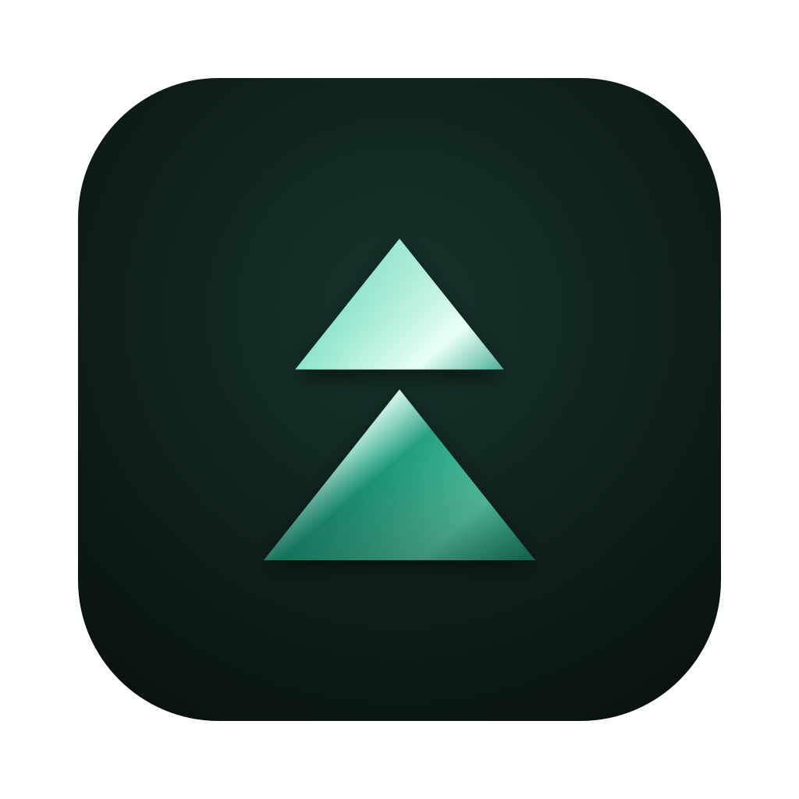
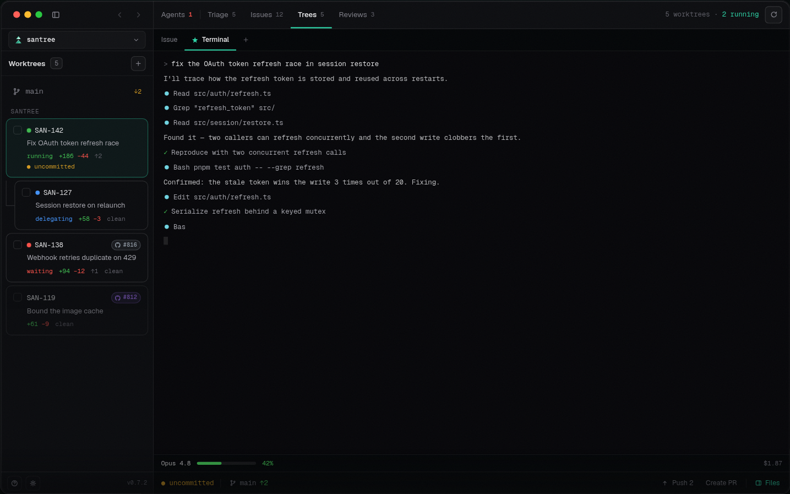

<div align="center">



# santree

**Your backlog, shipped in parallel.**

santree is a desktop app that runs Claude agents across your repo's tickets —
each in its own git worktree you can watch, steer, and merge.
Triage in, PRs out.

[](https://github.com/santree-ai/santree/releases/latest)
[](https://github.com/santree-ai/santree/actions/workflows/ci.yml)
[](LICENSE)

[**Website**](https://santree.toscanini.me) · [**Docs**](https://santree.toscanini.me/docs) · [**Download for macOS**](https://github.com/santree-ai/santree/releases/latest/download/santree-macos.dmg) · [**Changelog**](CHANGELOG.md)



</div>

## Why santree

Running one coding agent is easy. Running five is a workflow problem: they step
on each other's diffs, you lose track of who's blocked on you, and the actual
job — tickets in, reviewed PRs out — lives scattered across a tracker, a
terminal multiplexer, and a browser.

santree puts the whole loop in one window. Every task gets an **isolated git
worktree** with a **real terminal** running the real Claude Code CLI — your
login, your subscription, no API key. Around the terminals it builds the
workflow: a triage inbox from Linear, a dependency graph of your tickets, live
session states ("running", "waiting on you"), diff review with an AI
companion, and a PR dashboard. Nothing is mocked — every view is backed by
live data, and an unconnected view simply shows its honest empty state.

## One loop, five views

- 🔍 **Triage** — your team's untriaged Linear inbox, ranked by priority and
  SLA. Hit **Investigate** and an agent starts digging while you read the next
  ticket.
- 🗺 **Issues** — tickets drawn as a dependency graph, so you can see what's
  unblocked. Select the ready ones, pick a model, and launch agents in
  parallel.
- 🌲 **Trees** — the heart of the app: one worktree + one live terminal per
  task. Watch, interrupt, redirect; review the diff and open the PR without
  leaving.
- ✅ **Reviews** — a PR inbox with the diff, inline comments, CI (and
  "Fix CI with AI"), plus **Ask AI** to interrogate a PR beside the code.
- ⚙️ **Settings** — integrations, agents and models, env vars, appearance,
  updates. App-wide defaults, per-repo overrides.

## Install

**macOS** — [download the DMG](https://github.com/santree-ai/santree/releases/latest/download/santree-macos.dmg).
It's signed and notarized, and keeps itself up to date (pick the stable or
beta channel in *Settings → Updates*).

**Linux** — no packaged builds yet; [build from source](#building-from-source)
in a few minutes.

You'll also want:

- **git** — worktrees, diffs, and branches are the real thing.
- **[Claude Code](https://www.anthropic.com/claude-code)**, installed and
  logged in. santree drives the CLI you already have and never touches its
  credentials.
- **[GitHub CLI](https://cli.github.com)** (`gh`), signed in — optional,
  powers Reviews.
- A **[Linear](https://linear.app)** workspace — optional, powers Triage and
  Issues.

## Building from source

You need [Rust](https://rustup.rs) (the pinned toolchain installs
automatically), **Node 22+**, and **pnpm**. On Linux, install the WebKitGTK
dev libraries first — copy-paste commands for Debian/Ubuntu, Fedora, and Arch
are in [DEVELOPMENT.md](DEVELOPMENT.md#linux-system-dependencies).

```sh
pnpm install
pnpm dev        # first run compiles the Rust side — a few minutes, then fast
```

## Development

Architecture, data flow, testing, the release pipeline, and the terminal
internals live in [DEVELOPMENT.md](DEVELOPMENT.md). The ground rules for how
santree is allowed to interact with agent CLIs are in
[COMPLIANCE.md](COMPLIANCE.md) — they're load-bearing.

santree is pre-release and moving fast. Bug reports and small PRs are very
welcome; for anything bigger, open an issue first so we can talk it through.

## License

[MIT](LICENSE) © Santiago Toscanini
