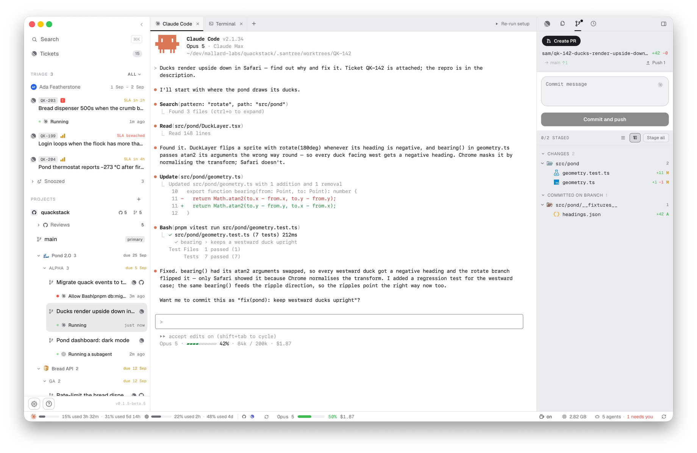
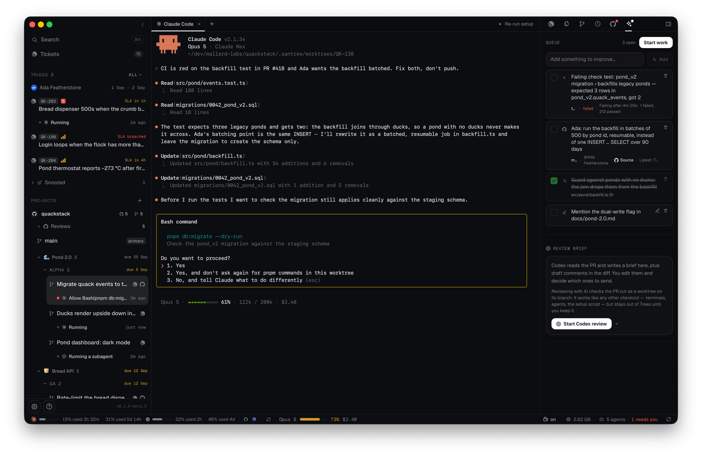
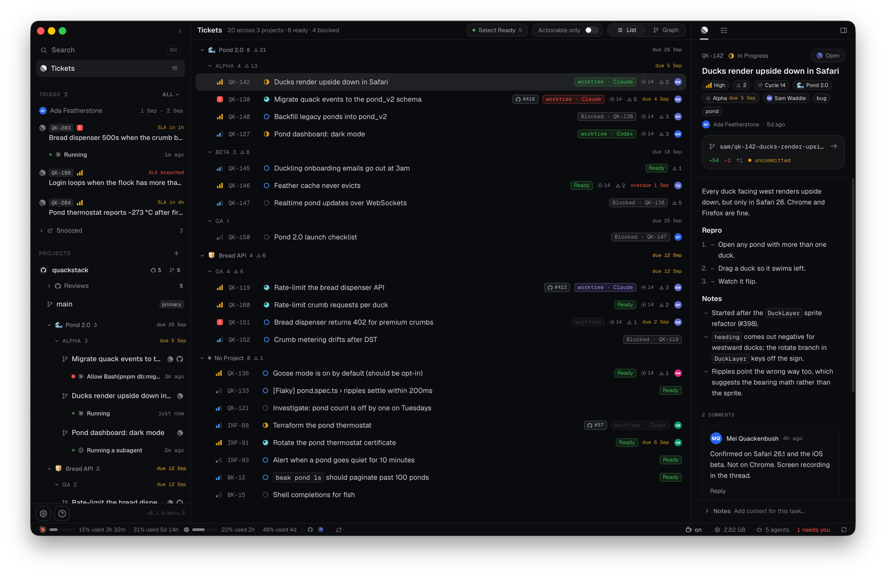
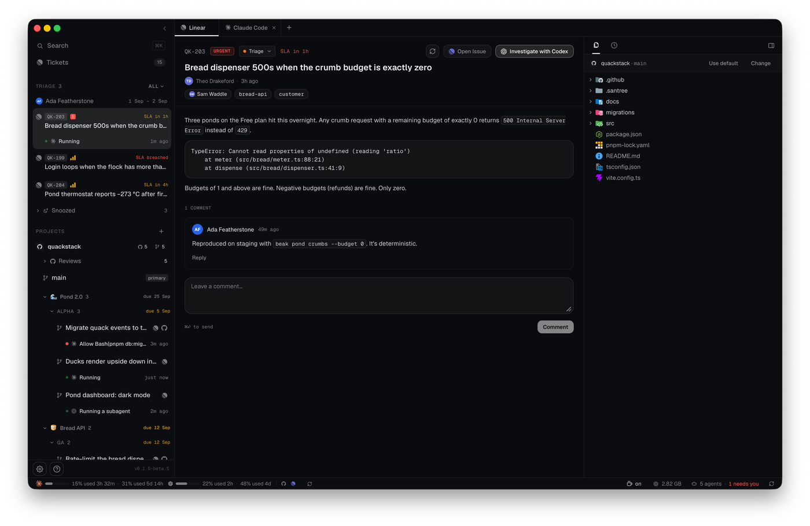
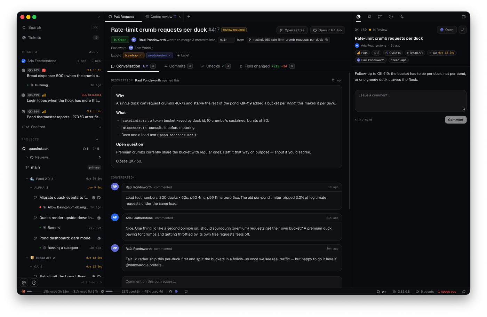

<div align="center">


# santree

**Your backlog, shipped in parallel.**

santree is a desktop app that runs Codex and Claude Code across your repo's tickets.
Each agent gets an isolated git worktree you can watch, steer, and merge.
Triage in, PRs out.

[](https://github.com/santree-ai/santree/releases/latest)
[](https://github.com/santree-ai/santree/actions/workflows/ci.yml)
[](LICENSE)

[**Website**](https://santree.toscanini.me) · [**Docs**](https://santree.toscanini.me/docs) · [**Download for macOS**](https://github.com/santree-ai/santree/releases/latest/download/santree-macos.dmg) · [**Changelog**](CHANGELOG.md)

<picture>
  <source media="(prefers-color-scheme: dark)" srcset=".github/assets/trees-dark.png" />
  
</picture>

</div>

## Why santree

Running one coding agent is easy. Running five is a workflow problem: they step
on each other's diffs, you lose track of who's blocked on you, and the actual
job (tickets in, reviewed PRs out) lives scattered across a tracker, a
terminal multiplexer, and a browser.

santree puts the whole loop in one window. Every task gets an **isolated git
worktree** with a **real terminal** running the real Codex or Claude Code CLI:
your login, your subscription, no credentials handled by santree. Around the
terminals it builds the workflow: a permanent sidebar that shows every agent's
state across every project, your team's triage queue with its SLA clock, your
tickets as a list or a dependency graph, a review inbox with an AI
co-reviewer, and a work queue that turns failing checks and review comments
into an agent's next task. Nothing is mocked: every view is backed by live
data, and an unconnected view shows its honest empty state.

## One window, one loop

The sidebar is the app's index. It never leaves: search, your tickets, the
triage queue, and every project with its worktrees and the agents running on
them, each with a dot that says *working*, *just finished*, or *needs you*.
The area beside it is whatever you picked.

- **Triage** lives in the sidebar. Who is on rotation, the tickets waiting
  with their SLA, and a snoozed group. Open one and it gets a workspace: the
  ticket, an **Investigate** agent digging through the project's main
  checkout, and a shell.
- **Tickets** is your Linear queue as a list grouped by project and
  milestone, or as a dependency graph. Every row says whether it is ready or
  what blocks it. **Run** starts a ticket in a new worktree; the launch queue
  starts several at once, each with its own agent.
- **Trees** is where you spend your time. One worktree per task, and a tab per
  agent or shell it has open. Beside the terminal: the ticket, the files, the
  branch's changes with a commit box, session history you can resume, and,
  once a PR exists, the PR itself and its **AI work queue**.
- **Reviews** is the inbox: other people's pull requests, per project, ordered
  by what needs you. The PR page has the conversation, commits, checks and
  files. An **AI review** reads the diff and writes a brief and draft comments
  that stay local until you publish them.
- **Your own PR** is worked on next to its worktree, not in the inbox. A
  failing check, a reviewer's comment, an AI draft or a diff line you flag all
  land in one queue, and **Start work** hands the whole queue to an agent.
- **Settings** holds the integrations, a provider and model per workflow
  (triage, work, reviews), the prompts every launch renders (Jinja templates
  you can edit and preview), environment variables, and usage.

<table>
  <tr>
    <td width="50%"></td>
    <td width="50%"></td>
  </tr>
  <tr>
    <td><sub><b>The work queue.</b> Failing checks, review comments and AI drafts, drained by one agent.</sub></td>
    <td><sub><b>Tickets.</b> Grouped by project and milestone; every row says what blocks it.</sub></td>
  </tr>
  <tr>
    <td></td>
    <td></td>
  </tr>
  <tr>
    <td><sub><b>Triage.</b> The ticket, an investigating agent, and the project it runs on.</sub></td>
    <td><sub><b>Reviews.</b> A teammate's PR with its AI review beside it, drafts held until you publish.</sub></td>
  </tr>
</table>

## Install

**macOS**: [download the DMG](https://github.com/santree-ai/santree/releases/latest/download/santree-macos.dmg).
It's signed and notarized, and keeps itself up to date (pick the stable or
beta channel in *Settings → General*).

**Linux**: no packaged builds yet; [build from source](#building-from-source)
in a few minutes.

You'll also want:

- **git**: worktrees, diffs, and branches are the real thing.
- At least one coding agent: **[Codex](https://developers.openai.com/codex/cli/)**
  or **[Claude Code](https://www.anthropic.com/claude-code)**, installed and
  logged in. santree drives the CLI you already have and never touches its
  credentials.
- **[GitHub CLI](https://cli.github.com)** (`gh`), signed in. Optional; it
  powers Reviews, the PR panes and the checks.
- A **[Linear](https://linear.app)** workspace. Optional; it powers Tickets
  and Triage.

## Building from source

You need [Rust](https://rustup.rs) (the pinned toolchain installs
automatically), **Node 22+**, and **pnpm**. On Linux, install the WebKitGTK
dev libraries first; copy-paste commands for Debian/Ubuntu, Fedora, and Arch
are in [DEVELOPMENT.md](DEVELOPMENT.md#linux-system-dependencies).

```sh
pnpm install
pnpm dev        # first run compiles the Rust side, a few minutes, then fast
```

## Development

Architecture, data flow, testing, the release pipeline, and the terminal
internals live in [DEVELOPMENT.md](DEVELOPMENT.md). The ground rules for how
santree is allowed to interact with agent CLIs are in
[COMPLIANCE.md](COMPLIANCE.md); they're load-bearing.

The screenshots above come from the app's screenshot fixture mode, a fake
company (Mallard Labs, makers of QuackStack) served to the real views; see
`src/dev/fixtures/README.md` to retake them.

santree is pre-release and moving fast. Bug reports and small PRs are very
welcome; for anything bigger, open an issue first so we can talk it through.

## License

[MIT](LICENSE) © Santiago Toscanini
